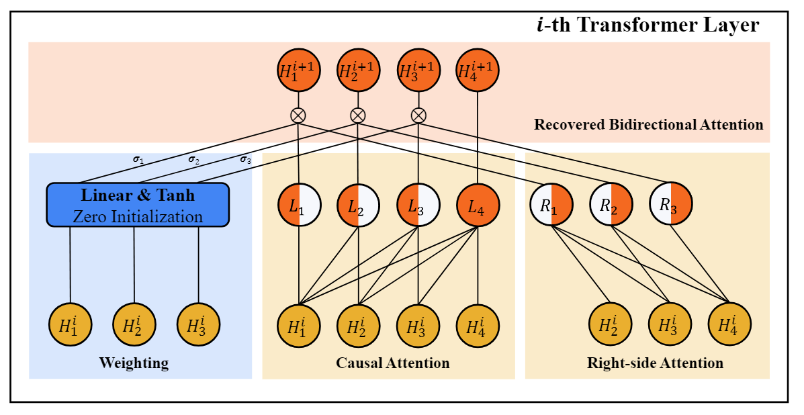

# Dec2Enc
Code for [**Transforming Decoder-Only Models into Encoder-Only Models with Improved
Understanding Capabilities**](https://www.sciencedirect.com/science/article/pii/S0950705124015417) (Accepted by KBS).

- We propose Dec2Enc, which transforms decoder-only models into encoder-only models by
recovering bidirectional attention, thereby improving their understanding potential. 

- In particular, Dec2Enc uses a zero initialization strategy that begins fine-tuning with the original causal attention mechanism, gradually learning bidirectional attention during
training, which mitigates the significant training disruptions that arise from mismatches between the attention mechanisms used in
pre-training and fine-tuning.




## Pip Installation
```angular2html
pip install -r requirements.txt
```
## Data Preparation

We use [CLEAN](https://github.com/carrotsx/Resources/tree/main/Datasets/MSQA/CLEAN1.0) dataset, [CMQA](https://github.com/juyiming/CMQA) dataset, [MLQA](https://github.com/facebookresearch/MLQA) dataset, and [C3](https://github.com/nlpdata/c3) dataset.

You can get it through their official website, or directly download the datasets in [here](https://drive.google.com/drive/folders/1zAiJM2G_hoc1G-sxt6lVoWb-VAF1UyYk?usp=drive_link), and put them under current folder.

## How to Run
Your can execute our bash scripts to train and evaluate our Dec2Enc:

```aiignore
bash scripts/run_clean.sh
```


## Experimental Results

- In experiments with various decoder-only models form 0.5B to 9B, Dec2Enc boosts understanding
capabilities and utilizes multilingual knowledge, achieving a 5.2% to 22.4% increase in the percentage of exact match answers
in seven languages compared to vanilla decoder-only models.

- Dec2Enc outperforms existing encoder-only models in four reading comprehension datasets in our experiments.


